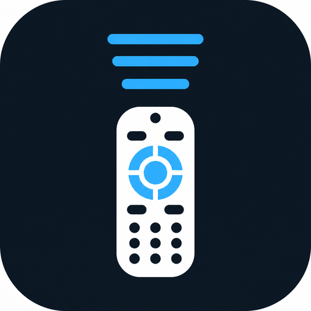

# TV Меню

Приложение для **Android TV / Google TV**: назначьте кнопку пульта (в том числе «Иви» / Wink), откройте быстрое меню с таймером сна и затемнением экрана.

**Репозиторий:** https://github.com/Arkasha18/TV-Menu  
**Актуальный релиз:** [Releases](https://github.com/Arkasha18/TV-Menu/releases/latest)  
**Лицензия:** [PolyForm Noncommercial 1.0.0](LICENSE) — свободное некоммерческое использование; коммерческое использование без отдельного разрешения запрещено.



## Возможности

- программирование специальной кнопки пульта;
- меню поверх экрана: таймер сна (от 30 мин до 3 ч) и 5 уровней затемнения;
- основной режим **без постоянного ПК** — через службу специальных возможностей;
- если переключатель службы «отскакивает» (часто на Android 14 / sideload) — встроенная активация через локальный ADB;
- локальный ADB — дополнительный режим.

## Требования

- Android TV / Google TV, Android 9+ (API 28+);
- разрешение «поверх окон» для затемнения;
- служба «TV Меню» в специальных возможностях.

## Установка

1. Скачайте APK из [Releases](https://github.com/Arkasha18/TV-Menu/releases/latest).
2. Установите на телевизор.
3. Откройте **TV Меню** → разрешите показ поверх окон.
4. Включите службу кнопок.
5. Запрограммируйте кнопку пульта.

Если служба сразу выключается — в приложении откройте инструкцию и нажмите **«Активировать службу сейчас»** (нужна включённая отладка по USB/Wi‑Fi на ТВ).

Подробный текст для 4PDA: [docs/4PDA.md](docs/4PDA.md).

## Сборка

### Docker (как в CI)

```bash
docker build --platform linux/amd64 -t tv-menu-build .
docker run --rm --platform linux/amd64 \
  -v "$PWD:/workspace" -w /workspace \
  tv-menu-build
```

Windows: `scripts\docker-build.bat`

### Локально

JDK 17 и Android SDK 35:

```bat
build.bat
```

или:

```bat
TvQuickMenu\gradlew.bat -p TvQuickMenu assembleDebug lintDebug
```

APK: `TvQuickMenu\app\build\outputs\apk\debug\app-debug.apk`

## Структура

| Путь | Назначение |
|------|------------|
| `TvQuickMenu/` | исходники Android-приложения |
| `Dockerfile` | воспроизводимая среда сборки (JDK 17 + SDK 35) |
| `.github/workflows/` | GitHub Actions CI |
| `docs/media/` | иконка, баннер, скриншоты |
| `docs/4PDA.md` | текст для темы на 4PDA |
| `scripts/` | вспомогательные скрипты сборки |

## Безопасность и вклад

- [SECURITY.md](SECURITY.md) — сообщения об уязвимостях
- [CONTRIBUTING.md](CONTRIBUTING.md) — как собирать и оформлять PR
- [SUPPORT.md](SUPPORT.md) — куда писать вопросы
- [CODE_OF_CONDUCT.md](CODE_OF_CONDUCT.md)
- [THIRD_PARTY_NOTICES.md](THIRD_PARTY_NOTICES.md)

## Лицензия

Код проекта распространяется по **PolyForm Noncommercial License 1.0.0**.

Разрешены личное, учебное, исследовательское и иное **некоммерческое** использование.  
**Коммерческое использование запрещено** без отдельного письменного разрешения правообладателя.

Контакт по коммерческим вопросам: [arkasha18@gmail.com](mailto:arkasha18@gmail.com).
